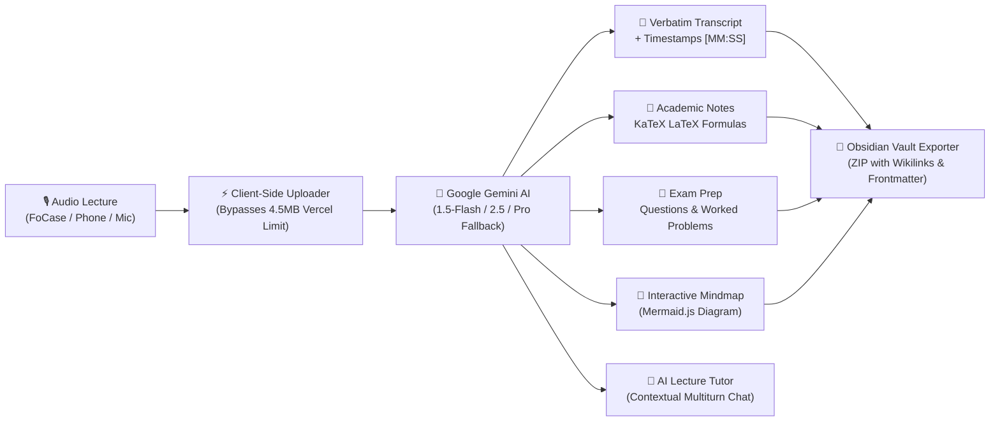

<div align="center">

# 🎓 OmniLecture Studio

**Academic-Grade STEM Audio Lecture Studio powered by Google Gemini AI & Local-First Architecture**

Turn voice recordings into structured academic study notes, LaTeX-rendered formulas, exam prep questions, interactive mindmaps, and complete Obsidian vaults.

[](https://recapp-rho.vercel.app)
[](https://nextjs.org/)
[](https://react.dev/)
[](https://www.typescriptlang.org/)
[](https://tailwindcss.com/)
[](LICENSE)

[🌐 Live App](https://recapp-rho.vercel.app) • [✨ Features](#-key-features) • [🔌 Hardware Recorders](#-hardware-recorders-integration-focase-olympus-sony) • [🚀 Quick Start](#-getting-started) • [📦 Obsidian Export](#-obsidian-vault-integration) • [🔒 Privacy](#-local-first--privacy-philosophy)

</div>

---

## 📖 Overview

**OmniLecture Studio** is a Progressive Web App (PWA) tailored for university students, researchers, and STEM academics. Traditional transcription software struggles with scientific jargon, mathematical equations, and hour-long lectures. 

OmniLecture bridges this gap by combining **Google Gemini multimodal models** with a **Local-First indexed database**, generating academic-level study materials with verifiable formulas, structured notes, and automated knowledge graphs.



---

## ✨ Key Features

### 📐 1. Full STEM & Mathematical LaTeX Support
- Native parsing of inline math (`$E=mc^2$`) and display equations (`$$\int_{-\infty}^{\infty} e^{-x^2} dx = \sqrt{\pi}$$`).
- Rendered via **KaTeX** for speed and typography fidelity.
- Theorem environments, proofs, definitions, and algorithmic step-by-step breakdowns.

### 🎙️ 2. Direct-to-Gemini Client-Side Upload
- **Zero file size bottlenecks**: Upload audio files exceeding 200MB+.
- Uses `multipart/related` client-side direct streaming to Google Gemini API endpoints, bypassing standard Vercel serverless request body limitations (4.5MB).
- Binary magic-byte sniffing (`detectAudioMimeType`) to automatically detect raw PCM WAV headers, MP3, M4A, FLAC, and WebM.

### 🎯 3. Strict Grounding (Anti-Hallucination)
- Strict grounding prompts ensure notes reflect **only** what was discussed in the lecture audio.
- Test files or short recordings (e.g., sound checks) are faithfully recognized without generating hallucinated theoretical notes from titles.

### 🧠 4. Interactive Mindmap Generation
- Automatic synthesis of lecture concept hierarchies into **Mermaid.js** mindmaps.
- Visual navigation of prerequisites, core concepts, and exam focal points.

### 💬 5. Context-Aware AI Lecture Chat
- Chat directly with an AI tutor grounded in the full lecture transcript.
- Built-in turn sanitization algorithm ensuring robust multiturn conversational flow without `HTTP 400` desynchronization.

### 💎 6. One-Click Obsidian Vault Exporter
- Exports an interconnected `.zip` vault ready to open directly in **Obsidian.md**, **Logseq**, or **Notion**.
- Automatically generates YAML frontmatter, tags (`#lecture`, `#stem`), and `[[wikilinks]]` between concepts, transcripts, and study guides.

### 🔒 7. Local-First & Privacy First
- All audio recordings, transcripts, summaries, and chat histories are stored client-side in the browser via **Dexie IndexedDB**.
- **BYOK (Bring Your Own Key)**: Use your own Google Gemini API key stored securely in your browser's `localStorage`. No data is stored on remote servers.

---

## 🔌 Hardware Recorders Integration (FoCase, Olympus, Sony)

OmniLecture Studio is designed to work seamlessly with dedicated hardware voice recorders (such as **FoCase Rec**, **Sony ICD**, **Philips VoiceTracer**, or **Olympus**):

### Workflow with FoCase Rec:
1. **Via USB-C / OTG (Recommended):**
   - Connect your FoCase recorder directly to your PC, Mac, iPad, or Android phone using a USB-C cable or OTG adapter.
   - The device mounts as standard mass storage.
   - Open **OmniLecture Studio**, click **"Nuova Registrazione"**, and select the `.wav` or `.mp3` file directly from the recorder's `RECORD` folder.
2. **Via FoCase Rec Companion App:**
   - Sync the recording via Bluetooth to the FoCase Rec app on your phone.
   - Tap **Share / Export** and select OmniLecture Studio (or save to Files and drag-and-drop into the browser).

> **Why not direct Web Bluetooth?**  
> Consumer Bluetooth recorders (including FoCase Rec) utilize proprietary BLE GATT encryption protocols tied to their proprietary mobile apps. USB-C / OTG mass-storage import provides 100% loss-free transfer speed without compression or battery drain.

---

## 🛠️ Tech Stack

| Layer | Technologies |
| :--- | :--- |
| **Framework** | [Next.js 15](https://nextjs.org/) (App Router, Server Actions) |
| **Frontend** | [React 19](https://react.dev/), [TypeScript](https://www.typescriptlang.org/), [Tailwind CSS](https://tailwindcss.com/) |
| **AI Engine** | [Google Gemini 1.5 Flash](https://ai.google.dev/) (Primary), 2.5 Flash & 1.5 Pro (Fallback) |
| **Audio Processing** | [WaveSurfer.js 7](https://wavesurfer.xyz/), Native Web Audio API |
| **Math & Markdown** | [KaTeX](https://katex.org/), `react-markdown`, `remark-math`, `rehype-katex`, `rehype-highlight` |
| **Diagrams** | [Mermaid.js 11](https://mermaid.js.org/) |
| **Storage** | [Dexie.js](https://dexie.com/) (IndexedDB wrapper, offline-first) |
| **Deployment** | [Vercel](https://vercel.com/) (Global Edge Network, PWA caching) |

---

## 🚀 Getting Started

### Prerequisites

- [Node.js](https://nodejs.org/) (version 18.18 or higher, Node 20+ recommended)
- [npm](https://www.npmjs.com/) or [pnpm](https://pnpm.io/)
- A free [Google Gemini API Key](https://aistudio.google.com/app/apikey)

### 1. Clone the repository

```bash
git clone https://github.com/lorisscosta/omnilecture-studio.git
cd omnilecture-studio
```

### 2. Install dependencies

```bash
npm install
```

### 3. Configure environment variables

Create a `.env.local` file in the root directory:

```env
# Optional: Default fallback Gemini API key for the server-side API proxy
GEMINI_API_KEY=your_gemini_api_key_here
```

*(Note: Users can also input their own API key directly in the app's Settings modal, stored exclusively in client-side `localStorage`).*

### 4. Run the development server

```bash
npm run dev
```

Open [http://localhost:3000](http://localhost:3000) in your browser.

### 5. Build for production

```bash
npm run build
npm run start
```

---

## 📦 Obsidian Vault Integration

OmniLecture Studio includes a dedicated export module generating ready-to-use Obsidian markdown structures:

```text
📁 My_Lecture_Obsidian_Vault/
│
├── 📄 Index.md                    # Overview, metadata, summary & quick links
├── 📄 Study_Guide.md              # Deep notes with KaTeX LaTeX formulas
├── 📄 Full_Transcript.md          # Verbatim audio transcript with [MM:SS] anchors
├── 📄 Exam_Preparation.md         # Practice questions & solutions
└── 📄 Glossary.md                 # Key terms with definitions & wikilinks
```

All notes cross-reference each other using `[[wikilinks]]` and standard Obsidian frontmatter:

```yaml
---
title: "Advanced Quantum Mechanics - Lecture 4"
date: 2026-09-25
tags:
  - university
  - physics
  - quantum-mechanics
  - omnilecture
---
```

---

## 🔒 Local-First & Privacy Philosophy

1. **No External Databases**: Your recordings and notes never touch third-party databases.
2. **Device Isolation**: Audio files are stored locally in IndexedDB in your browser cache.
3. **Encrypted Communications**: Audio is transferred strictly between your client browser and Google's official Gemini AI endpoints via HTTPS TLS 1.3.
4. **Instant Wipe**: You can delete single lectures or clear your entire local database with a single click.

---

## 📱 Progressive Web App (PWA)

Install OmniLecture Studio as a native desktop or mobile application:
- **Chrome / Edge / Brave (Desktop):** Click the install icon in the URL bar.
- **iOS / Safari:** Tap **Share** $\to$ **"Add to Home Screen"**.
- **Android / Chrome:** Tap the prompt **"Add OmniLecture to Home Screen"**.

---

## 🤝 Contributing

Contributions, issues, and feature requests are welcome!  
Feel free to check the [issues page](https://github.com/lorisscosta/omnilecture-studio/issues).

1. Fork the Project
2. Create your Feature Branch (`git checkout -b feature/AmazingFeature`)
3. Commit your Changes (`git commit -m 'Add some AmazingFeature'`)
4. Push to the Branch (`git push origin feature/AmazingFeature`)
5. Open a Pull Request

---

## 📄 License

Distributed under the MIT License. See `LICENSE` for more information.

---

<div align="center">
Built with ❤️ for STEM students & researchers worldwide.
</div>
