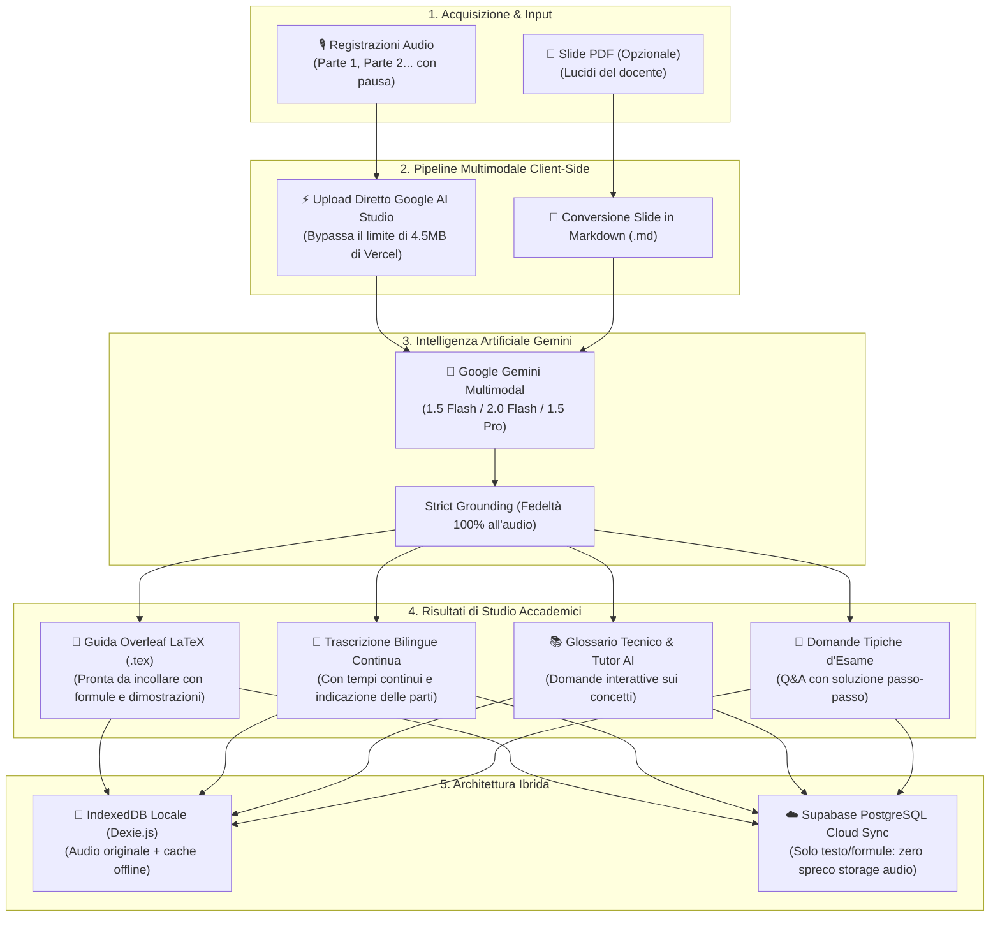

<div align="center">

# 🎓 OmniLecture Studio

**Academic-Grade STEM Audio Lecture Studio powered by Google Gemini Multimodal AI & Local-First Cloud Sync**

Trasforma registrazioni audio universitarie in guide allo studio complete per Overleaf in LaTeX, trascrizioni bilingui continue, domande d'esame e chat tutor accademica con supporto per slide PDF e registrazioni multi-spezzone.

[](https://recapp-rho.vercel.app)
[](https://nextjs.org/)
[](https://react.dev/)
[](https://www.typescriptlang.org/)
[](https://tailwindcss.com/)
[](https://supabase.com/)
[](LICENSE)

[🌐 Applicazione Live](https://recapp-rho.vercel.app) • [✨ Funzionalità](#-funzionalità-principali) • [🎙️ Registrazioni Multiple](#-supporto-registrazioni-multiple) • [☁️ Configurazione Supabase](#-configurazione-supabase-cloud-sync) • [🔑 Chiave Google Gemini](#-configurazione-chiave-google-gemini) • [▲ Deploy Vercel](#-deploy-su-vercel) • [📱 Uso Mobile & Registratori OTG](#-registratori-hardware--smartphone)

</div>

---

## 📖 Panoramica del Progetto

**OmniLecture Studio** è una Progressive Web App (PWA) progettata specificamente per studenti universitari e ricercatori in ambito STEM (Ingegneria, Fisica, Matematica, Informatica).

I software di trascrizione tradizionali falliscono quando si tratta di lezioni universitarie da due ore, terminologia scientifica densa, dimostrazioni analitiche e formule matematiche complesse. OmniLecture Studio risolve questo problema grazie all'elaborazione multimodale nativa con **Google Gemini (1.5 Flash / 2.0 Flash / 1.5 Pro)** unita a un'architettura **Local-First con Cloud Sync Solo Testo**:


```mermaid
flowchart TD
    subgraph INPUT["1. Acquisizione & Input"]
        A["🎙️ Registrazioni Audio\n(Parte 1, Parte 2... con pausa)"]
        B["📄 Slide PDF (Opzionale)\n(Lucidi del docente)"]
    end

    subgraph CLIENT["2. Pipeline Multimodale Client-Side"]
        A --> C["⚡ Upload Diretto Google AI Studio\n(Bypassa il limite di 4.5MB di Vercel)"]
        B --> D["📑 Conversione Slide in Markdown (.md)"]
    end

    subgraph AI["3. Intelligenza Artificiale Gemini"]
        C & D --> E["🤖 Google Gemini Multimodal\n(1.5 Flash / 2.0 Flash / 1.5 Pro)"]
        E --> F["Strict Grounding (Fedeltà 100% all'audio)"]
    end

    subgraph OUTPUT["4. Risultati di Studio Accademici"]
        F --> G["📐 Guida Overleaf LaTeX (.tex)\n(Pronta da incollare con formule e dimostrazioni)"]
        F --> H["📜 Trascrizione Bilingue Continua\n(Con tempi continui e indicazione delle parti)"]
        F --> I["📚 Glossario Tecnico & Tutor AI\n(Domande interattive sui concetti)"]
        F --> J["🎯 Domande Tipiche d'Esame\n(Q&A con soluzione passo-passo)"]
    end

    subgraph STORAGE["5. Architettura Ibrida"]
        G & H & I & J --> K["💾 IndexedDB Locale (Dexie.js)\n(Audio originale + cache offline)"]
        G & H & I & J --> L["☁️ Supabase PostgreSQL Cloud Sync\n(Solo testo/formule: zero spreco storage audio)"]
    end
```

---

## ✨ Funzionalità Principali

### 📐 1. Documento LaTeX (.tex) Integrale per Overleaf
- Genera un **documento accademico LaTeX completo** pronto per essere copiato e compilato con un solo click su [Overleaf](https://www.overleaf.com/).
- Include il preambolo accademico standard (`\documentclass{article}`, `\usepackage{amsmath,amssymb,amsthm,geometry,hyperref}`, `babel` italiano, impostazioni margini).
- Trattazione discorsiva rigorosa ed esaustiva di tutto ciò che il docente ha spiegato, formattando equazioni in ambiente `equation`, definizioni, teoremi e dimostrazioni passo-passo.
- Pulsante rapido **"Copia per Overleaf"** e download del file sorgente `.tex`.

### 🎙️ 2. Supporto Registrazioni Multiple per Lezione
- Consente di caricare **più registrazioni audio sequenziali** della stessa lezione (es. spegnendo il registratore prima della pausa e riaccendendolo alla ripresa).
- **Riordinamento visivo** con pulsanti [▲ Sposta Su] e [▼ Sposta Giù] per garantire la cronologia corretta.
- **Unificazione Automatica**: Gemini riceve tutti gli spezzoni e produce **UN UNICO** documento LaTeX, una trascrizione coerente continua e un glossario globale.
- **Player WaveSurfer con Playlist Automatica**: al termine di una parte avanza automaticamente alla traccia successiva; cliccando sui timestamp della trascrizione salta direttamente alla parte e al secondo corretti.

### 📜 3. Doppia Modalità Trascrizione (Continua & Segmenti)
- **Modalità Continua**: lettura fluida dell'intera lezione come un testo unico e continuo privo di interruzioni temporali, ideale per lo studio e la stampa.
- **Modalità Segmentata**: blocchi temporizzati con audio player sincronizzato, speaker e badge indicativo della parte audio.
- Filtri lingua istantanei: **Bilingue (Inglese + Traduzione Italiana)**, **Solo Italiano**, **Solo Inglese**.

### 📚 4. Glossario Tecnico & Tutor AI della Lezione
- Estrazione dei termini matematici e tecnici citati nella lezione con traduzione accademica e definizione rigorosa.
- **Tutor AI interattivo**: possibilità di porre domande e approfondimenti sui concetti spiegati direttamente dalla lezione, sfruttando le risposte basate esclusivamente sul materiale didattico.

### 📄 5. Integrazione Slide della Lezione (PDF $\to$ Markdown)
- Possibilità opzionale di allegare il **PDF delle slide**.
- Le slide vengono convertite automaticamente in Markdown formattato (`.md`) e confrontate da Gemini con l'audio registrato per inserire riferimenti puntuali e approfondire formule e diagrammi.

### 📱 6. Interfaccia Ergonomica per Smartphone (PWA)
- Piena reattività per schermi da 320px a 430px (iPhone, Android).
- Touch target comodi, toolbar audio WaveSurfer a due livelli e drawer laterale con chiusura a tocco sullo sfondo.

---

## ☁️ Configurazione Supabase (Cloud Sync Solo Testo)

OmniLecture Studio adotta un'architettura **Text-Only Cloud Sync**:
> **Perché non carichiamo l'audio nel cloud?**  
> I file audio delle lezioni possono pesare centinaia di megabyte. Conservando l'audio in locale (IndexedDB del browser) e sincronizzando su Supabase **esclusivamente i testi, le formule LaTeX, i glossari e le trascrizioni**, l'applicazione rispetta i limiti del piano gratuito di Supabase (50MB di upload e 1GB di database) a tempo indeterminato e a costo zero.

### 1. Crea un progetto su Supabase
1. Vai su [supabase.com](https://supabase.com/) e accedi (o registrati gratuitamente).
2. Clicca su **"New Project"** e inserisci nome del progetto e password del database.
3. Attendi il completamento del provisioning (circa 1-2 minuti).

### 2. Esegui lo Schema SQL nel SQL Editor
Apri la sezione **SQL Editor** nella dashboard di Supabase e incolla questo script per creare la tabella e le regole di sicurezza (RLS):

```sql
-- 1. Crea la tabella per memorizzare i testi delle lezioni
CREATE TABLE IF NOT EXISTS public.lectures (
    id UUID PRIMARY KEY,
    user_id UUID REFERENCES auth.users(id) ON DELETE CASCADE NOT NULL,
    title TEXT NOT NULL,
    course TEXT NOT NULL,
    date TEXT NOT NULL,
    audio_filename TEXT NOT NULL,
    duration INTEGER DEFAULT 0,
    glossary JSONB DEFAULT '[]'::jsonb,
    timestamped_transcript JSONB DEFAULT '[]'::jsonb,
    study_guide_it TEXT DEFAULT '',
    potential_exam_questions JSONB DEFAULT '[]'::jsonb,
    mermaid_mindmap TEXT DEFAULT '',
    slides_filename TEXT,
    slides_markdown TEXT,
    created_at TIMESTAMPTZ DEFAULT NOW(),
    updated_at TIMESTAMPTZ DEFAULT NOW()
);

-- 2. Abilita la Row Level Security (RLS) per proteggere i dati
ALTER TABLE public.lectures ENABLE ROW LEVEL SECURITY;

-- 3. Policy: ogni utente può visualizzare solo le proprie lezioni
CREATE POLICY "Users can select own lectures" 
ON public.lectures FOR SELECT 
USING (auth.uid() = user_id);

-- 4. Policy: ogni utente può inserire/aggiornare le proprie lezioni
CREATE POLICY "Users can insert own lectures" 
ON public.lectures FOR INSERT 
WITH CHECK (auth.uid() = user_id);

CREATE POLICY "Users can update own lectures" 
ON public.lectures FOR UPDATE 
USING (auth.uid() = user_id);

CREATE POLICY "Users can delete own lectures" 
ON public.lectures FOR DELETE 
USING (auth.uid() = user_id);
```

### 3. Recupera le credenziali API di Supabase
1. Nella dashboard di Supabase, vai su **Project Settings** (icona ingranaggio) $\to$ **API**.
2. Copia:
   - **Project URL** (es. `https://xyzcompany.supabase.co`)
   - **Project API Keys** $\to$ chiave pubblica **`anon` / `public`**

---

## 🔑 Configurazione Chiave Google Gemini

L'applicazione utilizza le API multimodali di Google per analizzare direttamente i file audio.

1. Vai su [Google AI Studio](https://aistudio.google.com/app/apikey).
2. Accedi con il tuo account Google e clicca su **"Create API Key"** (gratuita).
3. Copia la chiave generata (inizia con `AIzaSy...`).

### Dove inserire la chiave nell'applicazione:
- **Metodo Diretto (Consigliato):** Apri OmniLecture Studio nel browser, clicca sull'icona delle **Impostazioni** (⚙️) in alto a destra e incolla la tua chiave. Verrà salvata in modo sicuro nel `localStorage` del tuo browser (Bring Your Own Key).
- **Variabile d'Ambiente (Opzionale come fallback):** Puoi anche impostarla nel file `.env.local` come `GEMINI_API_KEY=tua_chiave`.

---

## ▲ Deploy su Vercel

Il progetto è pre-configurato per il deployment istantaneo su [Vercel](https://vercel.com/):

### 1. Collega il repository a Vercel
1. Esegui il fork o push del progetto sul tuo account GitHub.
2. Vai su [vercel.com](https://vercel.com/) e clicca su **"Add New..."** $\to$ **"Project"**.
3. Importa il repository `omnilecture-studio`.

### 2. Imposta le Variabili d'Ambiente su Vercel
Nella schermata di configurazione del progetto su Vercel, espandi la sezione **Environment Variables** e aggiungi:

| Nome Variabile | Descrizione | Esempio |
| :--- | :--- | :--- |
| `NEXT_PUBLIC_SUPABASE_URL` | URL del tuo progetto Supabase | `https://ffjvkuawnwelvoctjgkl.supabase.co` |
| `NEXT_PUBLIC_SUPABASE_ANON_KEY` | Chiave anon pubblica di Supabase | `eyJhbGciOiJIUzI1NiIsInR5cCI6IkpXVCJ9...` |
| `GEMINI_API_KEY` | *(Opzionale)* Fallback per proxy server | `AIzaSy...` |

### 3. Clicca su "Deploy"
Vercel compilerà ed eseguirà il deploy globale in circa 1 minuto.  
Ad ogni successivo `git push origin main`, Vercel aggiornerà automaticamente la versione in produzione.

---

## 🎙️ Registratori Hardware & Smartphone

OmniLecture Studio supporta l'acquisizione audio da qualsiasi registratore digitale (**FoCase Rec**, **Sony ICD**, **Philips VoiceTracer**, **Olympus**) e da smartphone:

1. **Collegamento Diretto USB-C / OTG:**
   - Collega il registratore vocale al PC, tablet o smartphone tramite cavetto USB-C o adattatore OTG.
   - Il registratore viene montato come memoria di massa USB.
   - Clicca su **"Nuova Registrazione"** e seleziona i file `.wav` o `.mp3` direttamente dalla memoria del registratore.
2. **Smartphone / App Companion (es. FoCase Rec):**
   - Sincronizza l'audio tramite Bluetooth sull'app dello smartphone.
   - Condividi o salva il file audio nella memoria del telefono e selezionalo dal browser mobile.

---

## 💻 Installazione Locale & Sviluppo

Se desideri eseguire il progetto in locale sul tuo computer:

```bash
# 1. Clona il repository
git clone https://github.com/lorisscosta/omnilecture-studio.git
cd omnilecture-studio

# 2. Installa le dipendenze
npm install

# 3. Crea il file .env.local
cp .env.example .env.local # oppure crea .env.local con le variabili indicate sopra

# 4. Avvia il server di sviluppo
npm run dev
```

Apri [http://localhost:3000](http://localhost:3000) nel tuo browser.

Per verificare la build di produzione in locale:
```bash
npm run build
npm run start
```

---

## 🛠️ Stack Tecnologico

| Componente | Tecnologia |
| :--- | :--- |
| **Framework** | [Next.js 15](https://nextjs.org/) (App Router, Server Actions) |
| **Frontend** | [React 19](https://react.dev/), [TypeScript](https://www.typescriptlang.org/), [Tailwind CSS](https://tailwindcss.com/) |
| **AI Multimodale** | [Google Gemini 1.5 Flash](https://ai.google.dev/) (Predefinito), Gemini 2.0 Flash, Gemini 1.5 Pro |
| **Audio Waveform** | [WaveSurfer.js 7](https://wavesurfer.xyz/) & HTML5 Web Audio API |
| **Database Locale** | [Dexie.js](https://dexie.com/) (IndexedDB client-side offline-first) |
| **Cloud Sync & Auth** | [Supabase](https://supabase.com/) (PostgreSQL & Row Level Security) |
| **Hosting & Edge** | [Vercel](https://vercel.com/) |

---

## 📄 Licenza

Rilasciato sotto licenza MIT. Consulta il file `LICENSE` per maggiori informazioni.

<div align="center">
Sviluppato con ❤️ per studenti universitari e ricercatori STEM.
</div>
